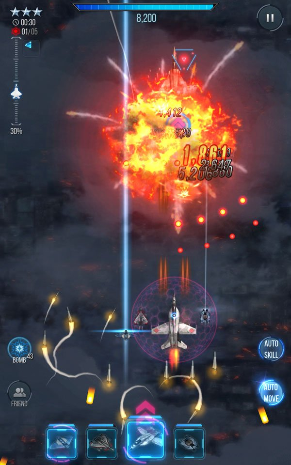
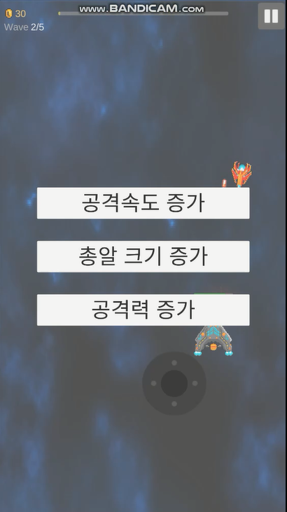

# 윙윙 (Wing Wing)

  

# [목차]
[1. 컨셉](#컨셉)  
[2. 관련 이미지](#관련-이미지)  
[3. 대표 이미지](#대표-이미지)  
[4. 컨셉 및 대표 이미지 기반 작품묘사](#컨셉-및-대표-이미지-기반-작품묘사)  
[5. 윙윙 구성 요소](#윙윙-구성-요소)  
[6. 게임 시스템 디자인](#게임-시스템-디자인)  
[7. 개발 요구사항 및 흐름도](#개발-요구사항-및-흐름도)  
[8. 개발작업 일정](#개발작업-일정)

  

# [컨셉]
## 메인컨셉 : 슈팅
- 슈팅 게임
### 서브컨셉 : 성장
- 성장형 슈팅 게임

  

# [관련 이미지]

  

# [대표 이미지]

  

# [컨셉 및 대표 이미지 기반 작품묘사]
> ### 대표이미지 기반 :

  

# [윙윙 구성 요소]
## 1. 메커니즘
[도전 과제]
1) 스테이지별 등장하는 적을 격파하고 성장하라

[재미 요소]
1) 적을 처치해 재화를 모아 성장한다.
2) 스테이지가 올라갈수록 강해지거나 더 많은 수의 여러 적이 출현하지만, 실력이 부족해도 기체의 성장을 통해 격파할 수 있다.

 

## 2. 이야기
[카메라 관점]  
탑뷰
	
 

## 3. 기술  
ㅇ

  

# [게임 시스템 디자인]
## 1. 게임 오브젝트 분해

|**연번**|**오브젝트 이름**|**오브젝트 이미지**|
|:---:|:---:|:---:|
|1|플레이어 전투기||
|2|적 일반 전투기||  
|3|적 보스 전투기||  

 

## 2. 파라미터

- 오브젝트 이름 : 플레이어 전투기

|**속성**|**속성값**|**설명**|**비고**|
|:---:|:---:|:---:|:---:|
|이름|플레이어 전투기|플레이어 캐릭터||
|EXP|레벨 상승 조건|적을 처치해 획득||
|레벨|스탯 포인트 1|스탯 포인트의 획득처||
|스탯|HP, Bullet 속성 등|플레이어의 능력치||
|GOLD|재화|상점 이용 가능||

- 오브젝트 이름 : 적 일반 전투기

|**속성**|**속성값**|**설명**|**비고**|
|:---:|:---:|:---:|:---:|
|체력|낮음|체력이 0이 되면 사망||
|공격력|낮음|*||
|공격속도|보통|*||
|이동속도|보통|*||

- 오브젝트 이름 : 적 보스 전투기

|**속성**|**속성값**|**설명**|**비고**|
|:---:|:---:|:---:|:---:|
|체력|높음|체력이 0이 되면 사망||
|공격력|보통|*||
|공격속도|느림|*||
|이동속도|느림|*||
|특수 패턴|*|특수한 패턴 발동||

 

## 3. 행동

- 오브젝트 이름 : 플레이어 전투기

|**행동**|**설명**|
|:---:|:---:|
|이동|터치를 이용한 플레이어 캐릭터의 이동|
|공격|전방으로의 자동 공격|
|스탯|레벨업시 플레이어의 능력치 상승|
|상점|재화를 이용한 기본 능력치 상승|

- 오브젝트 이름 : 적 일반 전투기

|**행동**|**설명**|
|:---:|:---:|
|공격|플레이어 공격|

- 오브젝트 이름 : 적 보스 전투기

|**행동**|**설명**|
|:---:|:---:|
|공격|플레이어 공격|
|특수 패턴|특수한 패턴 발동|

 

## 4. 상태

- 오브젝트 이름 : 플레이어 전투기

|**현상태**|**전이상태**|**전이조건**|
|:---:|:---:|:---:|
|대기|이동|터치 키 조작시|
|이동|대기|이동중 조작을 멈출시|
|생존|사망|HP가 0 이하로 떨어졌을 경우|
|사망|생존|재시작|

- 오브젝트 이름 : 적 일반 전투기

|**현상태**|**전이상태**|**전이조건**|
|:---:|:---:|:---:|
|대기|공격|공격범위 내에 플레이어 전투기가 있는 경우|
|공격|대기|공격범위 내에 플레이어 전투기가 없는 경우|
|사망|생존|HP가 0 이하로 떨어졌을 경우|

- 오브젝트 이름 : 적 보스 전투기

|**현상태**|**전이상태**|**전이조건**|
|:---:|:---:|:---:|
|이동|공격|공격범위 내에 플레이어 전투기가 있는 경우|
|공격|이동|공격범위 내에 플레이어 전투기가 있는 경우|
|일반 상태|특수 패턴|체력이 일정 수치 이하로 내려갈 경우 발동|
|사망|생존|체력이 0이 되었을 경우|

 

## 5. 플레이어 캐릭터 속성

|**속성**|**속성값**|**설명**|**비고**|
|:---:|:---:|:---:|:---:|
|이름|플레이어 전투기|플레이어 캐릭터||
|EXP|레벨 상승 조건|적을 처치해 획득||
|레벨|스탯 포인트 1|스탯 포인트의 획득처||
|스탯|HP, Bullet 속성 등|플레이어의 능력치 상승||
|GOLD|재화|상점 이용 가능||

 

## 6. 게임의 규칙
- 스테이지별로 등장하는 적을 격파해 스테이지를 올라 최종 보스를 격파한다.

 

## 7. 게임에서 사용될 공식
- 공격자의 공격력과 공격대상 체력(혹은 내구도)를 계산한다.

  

# [개발 요구사항 및 흐름도]
## 요구사항
- 게임화면은 화면 전체를 사용하며 상단에 UI가 표시된다.
- 게임화면 상단에는 레벨 및 경험치, 획득 재화, 웨이브 정보가 표시된다.
- 스마트폰 기기별 화면 크기가 바껴도 게임 화면 비율이 조정된다.
- 플레이어 전투기를 화면 하단에 배치한다.
- 플레이어 전투기를 따라다니는 HP UI를 배치한다.

- 적은 상단에서 출현한다.
- 적은 종류별 체력, 공격력, 공격속도, 이동속도, 특수능력을 가진다.
- 스테이지가 오를수록 적의 수는 많아지거나 강해지며, 스테이지 마지막엔 보스가 등장한다.
- 적은 플레이어를 향해 다가온다.
- 플레이어가 적에게 죽으면 패배한다.
- 적을 처치하면 재화를 얻을 수 있다.
- 적을 처치하면 경험치를 얻을 수 있다.
- 플레이어는 터치를 통해 이동이 가능하다.
- 플레이어는 자동으로 총알을 발사한다.
- 플레이어는 레벨업을 통해 능력을 상승시킬 수 있다.
- 플레이어는 대기실에서 상점 기능을 이용 가능하다.
- 플레이어는 상점에서 기본 스탯을 상승시킬 수 있다.
- 기본 스탯에는 HP, 공격력이 있다.
- 스탯 기능의 이용에는 스탯 포인트가 소모된다.
- 스탯 포인트는 레벨업당 한번 사용할 수 있다.
- 스탯 포인트로는 연사속도, 탄환 개수 등의 플레이어 능력치를 상승시킬 수 있다.
- 적을 처치시 경험치를 획득하여 레벨을 올릴 수 있다.

 

## 12주 요구사항
### Week 1
- 게임화면은 화면 전체를 사용하며 상단과 하단에 UI가 표시된다.
- 게임화면 상단에는 스테이지 정보가 표시된다.
  
- 적은 상단에서 출현한다.
- 적은 체력, 공격력, 공격속도, 이동속도, 특수능력을 가진다.
- 하단에서 플레이어가 방어한다.
- 플레이어는 키보드 조작(WASD)을 통해 이동이 가능하며, 마우스 좌클릭으로 공격이 가능하다.
  
- 적은 플레이어를 향해 다가온다.
- 플레이어가 적에게 죽으면 패배한다.

- 적을 처치하면 GOLD를 얻을 수 있다.
- 플레이어는 스탯 기능을 이용 가능하다.
- 스탯 기능의 이용에는 GOLD가 소모된다.
- 스탯 창에서 연사속도 등의 플레이어 능력치를 상승시킬 수 있다.
- 게임의 종료 조건은 모든 스테이지 클리어이다.
- 스테이지가 오를수록 적의 수는 많아지거나 강해진다.

 

## 용어정리  

|**No**|**화면**|**용어**|**설명**|  
|:---|:---|:---|:---|:---|  
|1|시작 화면|화면 요소|시작하기 버튼|클릭 시 게임화면으로 이동한다.|  
|2|게임 화면|화면 요소|EXP|레벨 상승에 필요한 수치를 나타낸다.|  
|3|게임 화면|화면 요소|레벨|현재 레벨을 보여준다.|  
|4|게임 화면|화면 요소|GOLD|현재 소지 GOLD를 보여준다.|   
|6|게임 화면|화면 요소|상점|상점창을 열 수 있는 버튼|  
|7|게임 화면|화면 요소|스탯|스탯창을 열 수 있는 버튼|  
|8|게임 화면|화면 요소|적|플레이어를 공격하는 적|   
|10|스크립트 요소|이동|터치를 통해 이동한다.|  

  

# 개발작업 일정
## 1주차 : UI 배치, 플레이어 배치, 화면 비율 조정 기능
- 게임화면은 화면 전체를 사용하며 상단에 UI가 표시된다.
- 게임화면 상단에는 레벨 및 경험치, 획득 재화, 웨이브 정보가 표시된다.
- 스마트폰 기기별 화면 크기가 바껴도 게임 화면 비율이 조정된다.
- 플레이어 전투기를 화면 하단에 배치한다.
- 플레이어 전투기를 따라다니는 HP UI를 배치한다.

## 2주차 : 플레이어, 적 구현  
- 적은 상단에서 출현한다. -> 사방에서 출현하도록 변경 (100%)
- 적은 체력, 공격력, 공격속도, 이동속도, 특수능력을 가진다. (90%)
- 하단에서 플레이어가 방어한다. -> 중앙에서 시작하도록 변경 (100%)
- 플레이어는 터치를 통해 이동이 가능하며, 마우스 좌클릭으로 공격이 가능하다. (100%)

## 3주차 : 스탯, 공격 알고리즘 구현  
- 적은 플레이어를 향해 다가온다. (100%)
- 플레이어가 적에게 죽으면 패배한다. (80%)

## 4주차->5주차 : 전투 구현 (100%)

## 5주차->6주차 : 전투를 통한 재화 획득 및 스탯 상승, UI 구현  
- 적을 처치하면 GOLD를 얻을 수 있다. (100%)
- 플레이어는 스탯 기능을 이용 가능하다. (100%)
- 스탯 기능의 이용에는 GOLD가 소모된다. (100%)
- 스탯 창에서 연사속도 등의 플레이어 능력치를 상승시킬 수 있다. (100%)

## 6주차->7주차 : 스테이지 구현 및 마무리 작업  
- 게임의 종료 조건은 모든 스테이지 클리어이다. (50%)
- 스테이지가 오를수록 적의 수는 많아지거나 강해진다. (50%)
