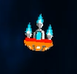

# 윙윙 (Wing Wing)

  

# [목차]
[1. 컨셉](#컨셉)  
[2. 관련 이미지](#관련-이미지)  
[3. 대표 이미지](#대표-이미지)  
[4. 윙윙 구성 요소](#윙윙-구성-요소)  
[5. 게임 시스템 디자인](#게임-시스템-디자인)  
[6. 개발 요구사항 및 흐름도](#개발-요구사항-및-흐름도)  
[7. 개발작업 일정](#개발작업-일정)  

  

# [컨셉]
## 메인컨셉 : 슈팅
- 슈팅 게임
### 서브컨셉 : 성장
- 성장형 슈팅 게임

  

# [관련 이미지]
 

  

# [대표 이미지]

  

# [윙윙 구성 요소]
## 1. 메커니즘
[도전 과제]
1) 스테이지별 등장하는 적들의 웨이브를 격파하고 성장하라

[재미 요소]
1) 적을 처치해 재화를 모아 성장한다.
2) 스테이지와 웨이브가 올라갈수록 강해지거나 더 많은 수의 여러 적이 출현하지만, 플레이어의 실력이 부족해도 기체의 성장을 통해 격파할 수 있다.

 

## 2. 이야기
[카메라 관점]  
탑뷰

  

# [게임 시스템 디자인]
## 1. 게임 오브젝트 분해

|**연번**|**오브젝트 이름**|**오브젝트 이미지**|
|:---:|:---:|:---:|
|1|플레이어 전투기||
|2|적 돌격형 전투기||  
|3|적 사격형 전투기||  

 

## 2. 파라미터

- 오브젝트 이름 : 플레이어 전투기

|**속성**|**속성값**|**설명**|**비고**|
|:---:|:---:|:---:|:---:|
|이름|플레이어 전투기|플레이어 캐릭터||
|EXP|레벨 상승 조건|적을 처치해 획득||
|레벨|스탯 포인트 1|스탯 포인트의 획득처||
|스탯|HP, Bullet 속성 등|플레이어의 능력치||
|GOLD|재화|상점 이용 가능||

- 오브젝트 이름 : 적 돌격형 전투기

|**속성**|**속성값**|**설명**|**비고**|
|:---:|:---:|:---:|:---:|
|체력|낮음|체력이 0이 되면 사망||
|공격력|높음|*||
|이동속도|보통|*||

- 오브젝트 이름 : 적 보스 전투기

|**속성**|**속성값**|**설명**|**비고**|
|:---:|:---:|:---:|:---:|
|체력|보통|체력이 0이 되면 사망||
|공격력|낮음|*||
|공격속도|느림|*||

 

## 3. 행동

- 오브젝트 이름 : 플레이어 전투기

|**행동**|**설명**|
|:---:|:---:|
|이동|터치를 이용한 플레이어 캐릭터의 이동|
|공격|전방으로의 자동 공격|
|스탯|레벨업시 플레이어의 능력치 상승|
|상점|재화를 이용한 기본 능력치 상승|

- 오브젝트 이름 : 적 돌격형 전투기

|**행동**|**설명**|
|:---:|:---:|
|추적|플레이어 추적|
|공격|플레이를 향해 비행|

- 오브젝트 이름 : 적 사격형 전투기

|**행동**|**설명**|
|:---:|:---:|
|이동|특정 좌표로 이동|
|공격|플레이어를 향해 사격|

 

## 4. 상태

- 오브젝트 이름 : 플레이어 전투기

|**현상태**|**전이상태**|**전이조건**|
|:---:|:---:|:---:|
|대기|이동|조이스틱 조작시|
|이동|대기|이동중 조작을 멈출시|
|생존|파괴|HP가 0 이하로 떨어졌을 경우|
|파괴|생존|재시작|

- 오브젝트 이름 : 적 돌격형 전투기

|**현상태**|**전이상태**|**전이조건**|
|:---:|:---:|:---:|
|생성|공격|플레이어 전투기가 존재하는 경우|
|생존|파괴|HP가 0 이하로 떨어졌을 경우|

- 오브젝트 이름 : 적 사격형 전투기

|**현상태**|**전이상태**|**전이조건**|
|:---:|:---:|:---:|
|생성|이동|플레이어 전투기가 존재하는 경우|
|이동|정지|특정 좌표에 도착한 경우|
|대기|사격|플레이어 전투기가 생존한 경우|
|사격|대기|플레이어 전투기가 파괴된 경우|
|생존|파괴|체력이 0이 되었을 경우|

 

## 5. 플레이어 캐릭터 속성

|**속성**|**속성값**|**설명**|**비고**|
|:---:|:---:|:---:|:---:|
|이름|플레이어 전투기|플레이어 캐릭터||
|EXP|레벨 상승 조건|적을 처치해 획득||
|레벨|스탯 포인트 1|스탯 포인트의 획득처||
|스탯|HP, Bullet 속성 등|플레이어의 능력치 상승||
|GOLD|재화|상점 이용 가능||

 

## 6. 게임의 규칙
- 스테이지별로 등장하는 적을 격파해 웨이브를 돌파한다.

 

## 7. 게임에서 사용될 공식
- 공격자의 공격력과 공격대상 체력(혹은 내구도)를 계산한다.

  

# [개발 요구사항 및 흐름도]
## 요구사항
- ~게임화면은 화면 전체를 사용하며 상단에 UI가 표시된다.~
- ~게임화면 상단에는 레벨 및 경험치, 획득 재화, 웨이브 정보가 표시된다.~
- ~플레이어 전투기의 EXP Slider UI를 배치한다.~
- ~스마트폰 기기별 화면 크기가 바껴도 게임 화면 비율이 조정된다.~
- ~플레이어 전투기를 화면 하단에 배치한다.~
- ~플레이어 전투기를 따라다니는 HP Slider UI, HP Text UI를 배치한다.~
- ~무한 배경을 이용한 속도감을 연출한다.~

- ~플레이어는 자동으로 총알을 발사한다.~
- ~플레이어의 경험치 파라미터를 구현한다.~
- ~경험치 파라미터를 EXP Slider UI와 연동한다.~
- ~플레이어의 스테이터스 중 HP 파라미터를 구현한다.~
- ~HP 파라미터를 HP Slider UI와 연동한다.~
- ~플레이어의 스테이터스 중 공격 속도를 구현한다.~

- ~플레이어의 HP를 숫자 표기 UI와 연동한다.~
- ~적은 상단에서 출현한다.~
- ~적은 체력 스테이터스를 갖는다.~
- ~플레이어의 총알은 공격력을 갖는다.~
- ~적은 플레이어의 총알에 맞으면 데미지를 입는다.~
- ~적은 체력이 0 이하로 떨어졌을 때 파괴된다.~
- ~플레이어가 적을 처치하면 해당하는 적의 경험치를 얻는다.~
- ~플레이어가 적을 처치하면 해당하는 적의 재화를 얻는다.~

- ~플레이어는 스테이지 시작시 총알 발사 방식중 하나를 선택 가능하다.~
- ~플레이어의 공격 방식중 하나는 공격 범위가 1자이며 공격속도가 보통인 기본형이다.~
- ~플레이어의 공격 방식중 하나는 공격 범위가 랜덤하며 공격속도가 빠른 연사형이다.~
- ~플레이어의 공격 방식중 하나는 공격 범위가 넓고 공격속도가 느린 방사형이다.~
- ~플레이어의 총알은 Instantiate과 Destroy가 아닌 SetActive를 활용한다.~

- ~플레이어는 터치를 따라 이동이 가능하다.~
- ~플레이어의 최대 이동속도는 제한되어있다.~
- ~총알을 발사할 때 발사 효과음이 재생된다.~
- ~적이 파괴될 때 파괴 효과음이 재생된다.~
- ~적이 파괴될 때 파괴 애니메이션이 재생된다.~

- ~플레이어의 경험치 요구량은 레벨에 따라 다르다.~
- ~플레이어의 경험치가 일정 수치에 도달하면 레벨업한다.~
- ~경험치가 요구치에 도달하면 게임이 일시정지된다.~
- ~플레이어는 레벨업을 통해 랜덤한 세가지 능력중 하나를 상승시킬 수 있다.~

- ~플레이어가 레벨업을 통해 상승시킬수 있는 능력중에는 하나는 HP 자동회복이 있다. ~
- ~플레이어가 레벨업을 통해 상승시킬수 있는 능력중에는 하나는 공격속도 증가가 있다. ~
- ~플레이어가 레벨업을 통해 상승시킬수 있는 능력중에는 하나는 공격력 증가가 있다. ~
- ~플레이어가 레벨업을 통해 상승시킬수 있는 능력중에는 총알 크기 증가가 있다. ~

- ~적 type A는 특정 위치에서 스폰 후 특정 위치까지 이동한 뒤 플레이어를 향해 사격한다.~
- ~적 type A는 HP, 총알 공격력, 연사 속도, 이동 속도, 충돌시 공격력을 갖는다.~
- ~적 type B는 특정 위치에 스폰 후 플레이어 방향으로 돌격해 자폭한다.~
- ~적 type B는 HP, 이동 속도, 충돌시 공격력을 갖는다.~

- ~웨이브 구현 (100%)
- ~해당 웨이브의 적을 모두 처치하면 다음 웨이브로 넘어간다.~
- ~플레이어가 적에게 죽으면 패배한다.~
- ~사망시 재도전 기능 구현~
- ~게임종료 기능 구현~
- ~이동 개선~

- ~로비 UI 및 기능 구현 + 게임 오버시 로비로 이동~
- ~게임 씬과 로비 씬간에 주고받는 변수 정리~
- ~상점 UI 및 기능 구현~
- ~웨이브 클리어시 오브젝트 삭제~

- ~일시정지 UI 및 게임 플레이중 일시정지 기능 구현~
- ~플레이어가 레벨업을 통해 상승시킬수 있는 능력 상한 구현~
- ~조이스틱 이동 구현~

 

## 용어정리  

|**No**|**화면**|**용어**|**설명**|  
|:---|:---|:---|:---|:---|  
|1|시작 화면|화면 요소|시작하기 버튼|클릭 시 게임화면으로 이동한다.|  
|2|게임 화면|화면 요소|EXP|레벨 상승에 필요한 수치를 나타낸다.|  
|3|게임 화면|화면 요소|레벨|현재 레벨을 보여준다.|  
|4|게임 화면|화면 요소|GOLD|현재 소지 GOLD를 보여준다.|   
|6|게임 화면|화면 요소|상점|상점창을 열 수 있는 버튼|  
|7|게임 화면|화면 요소|스탯|스탯창을 열 수 있는 버튼|  
|8|게임 화면|화면 요소|적|플레이어를 공격하는 적|   
|10|스크립트 요소|이동|터치를 통해 이동한다.|  

  

# 개발작업 일정
## Week 1 : UI 배치, 플레이어 배치, 화면 비율 조정 기능, 무한 배경 구현
- 게임화면은 화면 전체를 사용하며 상단에 UI가 표시된다. (100%)
- 게임화면 상단에는 레벨 및 경험치, 획득 재화, 웨이브 정보가 표시된다. (50% - UI 배치 O, 기능 구현 X)
- 플레이어 전투기의 EXP Slider UI를 배치한다. (50% - UI 배치 O, 기능 구현 X)
- 스마트폰 기기별 화면 크기가 바껴도 게임 화면 비율이 조정된다. (100%)
- 플레이어 전투기를 화면 하단에 배치한다. (100%)
- 플레이어 전투기를 따라다니는 HP Slider UI, HP Text UI를 배치한다. (50% - UI 배치 O, 기능 구현 X)
- 무한 배경을 이용한 속도감을 연출한다. (100%)

## Week 2 : 플레이어 자동 공격, 경험치, 스테이터스(HP, 공격 속도) 구현
- 플레이어는 자동으로 총알을 발사한다. (100%)
- 플레이어의 경험치 파라미터를 구현한다. (100%)
- 경험치 파라미터를 EXP Slider UI와 연동한다. (100%)
- 플레이어의 스테이터스 중 HP 파라미터를 구현한다. (100%)
- HP 파라미터를 HP Slider UI와 연동한다. (100%)
- 플레이어의 스테이터스 중 공격 속도를 구현한다. (100%)

## 3주차 : HP UI, 공격 상호작용, 적 파괴시 경험치 및 재화 획득, 오브젝트 풀링(총알) 구현  
- 플레이어의 HP를 숫자 표기 UI와 연동한다. (100%)
- 적은 상단에서 출현한다. (100%)
- 적은 체력 스테이터스를 갖는다. (100%)
- 플레이어의 총알은 공격력을 갖는다. (100%)
- 적은 플레이어의 총알에 맞으면 데미지를 입는다. (100%)
- 적은 체력이 0 이하로 떨어졌을 때 파괴된다. (100%)
- 플레이어가 적을 처치하면 해당하는 적의 경험치를 얻는다. (100%)
- 플레이어가 적을 처치하면 해당하는 적의 재화를 얻는다. (100%)

## 4주차 : 총알 발사 방식 선택, 공격 3종 구현  
- 플레이어는 스테이지 시작시 총알 발사 방식중 하나를 선택 가능하다. (50% UI 미완성)
- 플레이어의 공격 방식중 하나는 공격 범위가 1자이며 공격속도가 보통인 기본형이다. (100%)
- 플레이어의 공격 방식중 하나는 공격 범위가 랜덤하며 공격속도가 빠른 연사형이다. (100%)
- 플레이어의 공격 방식중 하나는 공격 범위가 넓고 공격속도가 느린 방사형이다. (100%)

## 5주차 : 플레이어 이동, 일부 효과음 및 애니메이션 구현
- 플레이어는 터치를 따라 이동이 가능하다. (100%)
- 플레이어의 최대 이동속도는 제한되어있다. (100%)
- 총알을 발사할 때 발사 효과음이 재생된다. (100%)
- 적이 파괴될 때 파괴 효과음이 재생된다. (100%)
- 적이 파괴될 때 파괴 애니메이션이 재생된다. (100%)

## 6주차 : 플레이어의 레벨업, 게임 일시정지, 레벨업 보상 선택 UI 구현
- 플레이어의 경험치 요구량은 레벨에 따라 다르다. (100%)
- 플레이어의 경험치가 일정 수치에 도달하면 레벨업한다. (100%)
- 경험치가 요구치에 도달하면 게임이 일시정지된다. (100%)
- 플레이어는 레벨업을 통해 랜덤한 세가지 능력중 하나를 상승시킬 수 있다. (50% 기능 미완성)

## 7주차 : 플레이어가 레벨업으로 얻을 수 있는 능력 구현
- 플레이어가 레벨업을 통해 상승시킬수 있는 능력중에는 하나는 최대 HP 상승이 있다.(100%)
- 플레이어가 레벨업을 통해 상승시킬수 있는 능력중에는 하나는 HP 자동회복이 있다. (100%)
- 플레이어가 레벨업을 통해 상승시킬수 있는 능력중에는 하나는 공격속도 증가가 있다. (100%)
- 플레이어가 레벨업을 통해 상승시킬수 있는 능력중에는 하나는 공격력 증가가 있다. (100%)
- 플레이어가 레벨업을 통해 상승시킬수 있는 능력중에는 총알 크기 증가가 있다. (100%)

## 8주차 : 적 패턴 구현
- 적 type A는 특정 위치에서 스폰 후 특정 위치까지 이동한 뒤 플레이어를 향해 사격한다. (50%)
- 적 type A는 HP, 총알 공격력, 연사 속도, 이동 속도, 충돌시 공격력을 갖는다. (100%)
- 적 type B는 특정 위치에 스폰 후 플레이어 방향으로 돌격해 자폭한다. (100%)
- 적 type B는 HP, 이동 속도, 충돌시 공격력을 갖는다. (100%)

## 9주차 : 웨이브 구현, 플레이어 사망 구현
- 웨이브 구현 (100%)
- 해당 웨이브의 적을 모두 처치하면 다음 웨이브로 넘어간다. (90%, 기능 구현)
- 플레이어가 적에게 죽으면 패배한다. (100%)
- 사망시 재도전 기능 구현 (100%)
- 게임종료 기능 구현 (100%)
- 이동 개선 (100%)

## 10주차 : 대기실 구현, 스테이지 lock/unlock 구현
- 로비 UI 및 기능 구현 + 게임 오버시 로비로 이동 (100%)
- 게임 씬과 로비 씬간에 주고받는 변수 정리 (100%)
- 상점 UI 및 기능 구현 (100%)
- 웨이브 클리어시 오브젝트 삭제 (100%)

## 11주차 : 대기실 마무리, 내부 시스템 구현, 플레이어가 레벨업으로 얻을 수 있는 능력 추가
- 일시정지 UI 및 게임 플레이중 일시정지 기능 구현 (100%)
- 플레이어가 레벨업을 통해 상승시킬수 있는 능력 상한 구현 (100%)
- 조이스틱 이동 구현(100%)

## 12주차 : 마무리
- 미비사항 마무리
